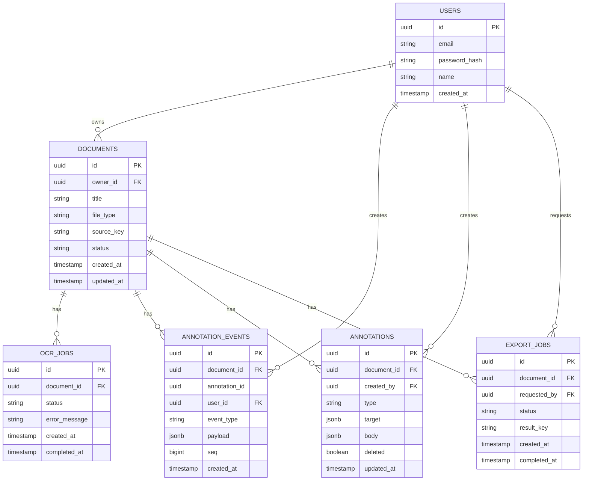

# 문서 필기 웹사이트 — 아키텍처 설계 정리

## 1. 서비스 개요
논문·페이퍼리뷰 등 문서를 볼 때 종이에 밑줄/하이라이트/메모를 붙이듯, 온라인에서 PDF·HTML 문서를 업로드하면 하이라이트, 볼드, 텍스트 색상 변경, 메모 첨부 등 인터랙티브한 주석을 달 수 있는 서비스.

## 2. 주석 데이터 형식
- **W3C Web Annotation Data Model (JSON-LD)** 채택
- 원본 문서(PDF/HTML)와 주석 데이터를 분리 저장
- HTML 문서: TextQuoteSelector / TextPositionSelector로 위치 지정
- PDF 문서: page + bbox 좌표로 위치 지정

## 3. 아키텍처 패턴
- **모듈러 모놀리식** — Document / Annotation / User / Export 네 개 모듈, 단일 배포 단위지만 모듈 간 DB 직접 접근 금지
- **Annotation 모듈은 CQRS + Event Sourcing**
- OCR·PDF 렌더링처럼 무거운 작업은 별도 비동기 워커로 분리
- **문서 버전 관리**: 최신 버전 + 직전 버전까지만 보존
- **실시간 협업**: 현재 범위 밖 (필요해지면 그때 CRDT 도입 검토)

## 4. 기술 스택

| 영역 | 선택 | 비고 |
|---|---|---|
| 프론트엔드 | React | |
| 메인 백엔드 | Java | CQRS/ES 구현 시 Axon Framework 등 활용 가능 |
| 비동기 워커 | Go | OCR·PDF 렌더링 담당, segmentio/kafka-go 사용 |
| 메시징 | Kafka | Annotation 이벤트 로그와 워커 job 큐를 동일 인프라로 재사용 |
| DB | PostgreSQL | JSONB + GIN 인덱스 |
| 오브젝트 스토리지 | MinIO (1차) + R2/B2 (백업) | |
| OCR 엔진 | PaddleOCR PP-OCRv5 (한글 모델) | |
| Annotation 앵커링 | dom-anchor-text-quote/position (HTML), pdf.js getTextContent (PDF) | |
| 인증 | 이메일 인증 + Google/Naver/Kakao 소셜 로그인 | |

## 5. DB 스키마 (ERD)

## 6. 배포 / 인프라
- **클러스터**: k3s (Vultr 서울 리전 VPS) — 로컬 개발/매니페스트 검증은 minikube
- **Ingress**: Traefik (k3s 기본 내장)
- **TLS**: cert-manager + Let's Encrypt (HTTP-01)
- **CI/CD**: GitHub Actions — 빌드 → 모듈별 유닛 테스트 → 통합 테스트 → 이미지 GHCR 푸시 → k3s 배포
- **로깅**: Grafana Loki + Promtail + Grafana
- **DB 백업**: PostgreSQL pg_dump 스케줄
- **도메인**: 아직 미확보, 우선 로컬 환경 기준으로 개발/구동

## 7. 보안 고려사항

| 영역 | 위험 | 대응 |
|---|---|---|
| OCR·PDF 렌더링 워커 | 악성 PDF로 파서 공격 | 네트워크 격리 컨테이너, 리소스 제한, CDR 검토 |
| 업로드 | MIME 스푸핑, zip bomb | 매직바이트 검증, 화이트리스트, 용량 제한, 안티멀웨어 |
| Annotation 콘텐츠 | 저장형 XSS | 서버사이드 새니타이징, sandbox iframe, CSP |
| 접근권한 | IDOR | 서버사이드 소유권 검증 |
| 저장소 | 퍼블릭 노출 | private 버킷 + 서명 URL, 암호화 |
| 이벤트 스토어 | GDPR 삭제 요청 | tombstone 이벤트 + crypto-shredding |
| 인증/API | 무차별 로그인, CSRF | rate limiting(Traefik 미들웨어), bcrypt/argon2, Secure 쿠키, CSRF 토큰 |
| Export | SSRF | 외부 리소스 로딩 화이트리스트 |

## 8. 미정 사항 (TBD)
- VPS 사양 산정 (k3s + PostgreSQL + Kafka + MinIO + Loki 동시 운영 리소스 소요량)
